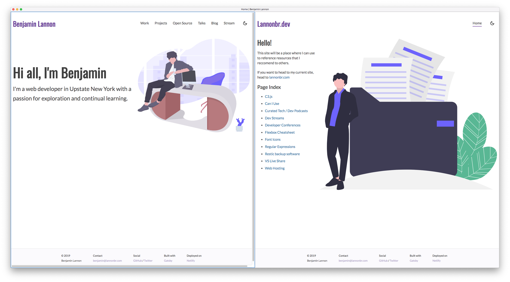
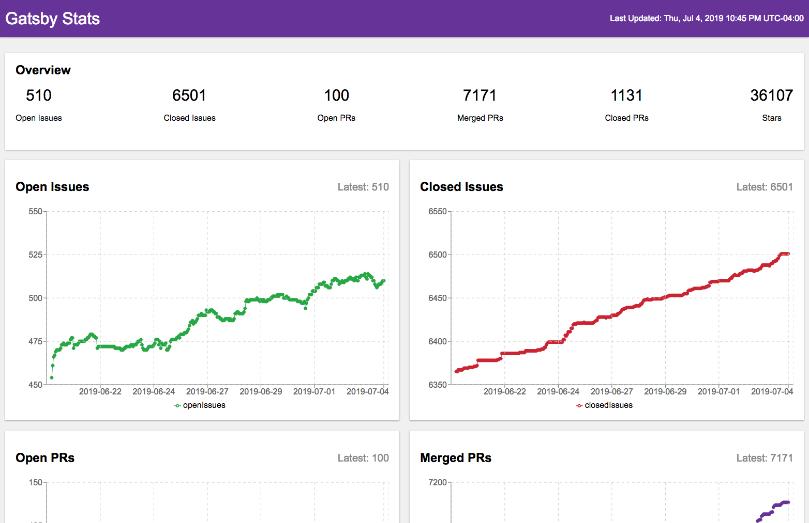

July 3rd was a big launch for Gatsby Themes. It is a API to share functionality, data sourcing, styles, and other features of Gatsby sites into packages. Themes used to be available in Gatsby under a `__experimentalThemes` field of the `gatsby-config`, but as of Wednesday with the official launch of Themes in Gatsby 2.13.0, the functionality of themes are just now part of Gatsby's plugin ecosystem.

It is as simple as getting a Gatsby site up and running with `gatsby new`, downloading some themes, and letting them do the heavy lifting of creating components, GraphQL queries, and plenty of other things to make your job as a consumer of themes effortless.

I've been using Themes for the past few months myself and I thought it would be useful to describe the initial benefits of abstracting sites into themes and how you can get started with such.

## Sites to Themes

My first theme I created is one called [gatsby-theme-lannonbr](https://github.com/lannonbr/gatsby-theme-lannonbr). It is currently being used both on lannonbr.com, this site, as well as lannonbr.dev, a dev resources site I've built.



Through both sites, I have a variety of React components that define site-wide layouts. things such as the site header and footer have a consistent feel on both sites. As well, I include other features as a color mode switcher to go between a light and dark mode.

With all of these components, I can abstract some global components and then if I want to jumpstart a new site with this theme, All I need to do is add the theme and start creating content immediately.

It can make sense at a high level, but someone may be interested in the technical details of transferring portions of their site over to a Gatsby Theme. This past Wednesday to go along with the launch, I transferred my gatsby-github-stats site over to a theme.

## Deep Dive - Gatsby-GitHub-Stats

[Gatsby-github-stats](https://gatsby-github-stats.netlify.com/) is a statistics dashboard made in Gatsby to present a overview of how different metrics like Pull Requests, Issues, Stars, and others change over time for specifically Gatsby's GitHub repo. It's been running smoothly, but many people have come up to me and requested:

> Hey Ben, but what if I want to use this site for my repo, or any repo on GitHub?

That's exactly where a theme could come in handy. I could take the main work of the site out into an installable package and then all someone needs to do is provide the data for their repo.

As mentioned, I streamed work on transitioning this site to be a Gatsby Theme. If you wish to watch my stream, there's an archived video of it on Twitch: [Modifying a Gatsby site to a Theme](https://www.twitch.tv/videos/447835544) (The first half of the stream is mainly discussing what Gatsby Themes can do, while the second half is getting my hands dirty and converting the site to a theme). The rest of this post is going to summarize that stream and some things that one should keep in mind when developing a theme.

### Almost as easy as copy-paste

If you want to see the end result, I have a tagged version of the theme up on GitHub here: [lannonbr/gatsby-theme-github-stats@0.1.0](https://github.com/lannonbr/gatsby-theme-github-stats/tree/0.1.0)

What I started out doing was setting up a [yarn workspace](https://yarnpkg.com/lang/en/docs/workspaces/) so I could have a testing playground to have the theme and an example site side-by-side. This article will assume you have some understanding of how workspaces works, so read the linked doc to get some basic understanding if you don't already. I copied a cloned version of gatsby-github-stats into this workspace as a base and then it was mainly copying files over to the theme.

I renamed the name field in the site's package.json to `site` so if I want to use it from the workspace's root, I can just type `yarn workspace site <command>`

As we want to setup some configuration of various Gatsby plugins for this theme, we can go ahead and create a `gatsby-config.js` file. I copied the entries for all of the plugins that I needed for the site.

```js
module.exports = {
  plugins: [
    {
      resolve: `gatsby-source-filesystem`,
      options: {
        name: `data`,
        path: `${__dirname}/src/data/`,,
      },
    },
    `gatsby-plugin-react-helmet`,
    `gatsby-transformer-json`,
  ],
}
```

As well, given I want to use these plugins inside the theme, I added them into the theme's `package.json` file. One thing in particular I did was rather than adding `react`, `react-dom` and `gatsby` as direct dependencies, I added them instead as `peerDependencies` so the theme will not directly install them but rather expect that the site that uses it will have them as dependencies.

Next, I copied over the pages from the site's `src/pages/` directory into the theme's `src/pages/` as well as a `src/components/` directory. Then I cleaned up the site's repository by deleting those files out of it and then reconfiguring the `gatsby-config` to use our theme.

```js
module.exports = {
  plugins: [
    {
      resolve: `gatsby-theme-github-stats`,
      options: {},
    },
  ],
}
```

Now, you could think you would now just run `gatsby develop` and everything would work, but there are some gotchas that you have to do on the conversion process.

### Gotcha #1: Directory management

In the way I laid out my site using the theme, I kept `src/data/data.json` explicitly in the site's directory. That data.json file is the data source for the entire site, but with the current setup of the Theme's gatsby-config, it is sourcing it as follows:

```js
module.exports = {
  plugins: [
    {
      resolve: `gatsby-source-filesystem`,
      options: {
        name: `data`,
        path: `${__dirname}/src/data/`,,
      },
    },
  ]
}
```

That is saying load files from the current directory and then `/src/data/` inside. That said, the current diectory here is the theme's directory and not our site. To fix this, we can pass down options for our themes from the site's `gatsby-config` file.

In the site's `gatsby-config`, let's set up a dataPath field and drop in the site's `src/data/` so it uses that instead of the theme's path.

```js
const path = require('path')

module.exports = {
  plugins: [
    {
      resolve: `gatsby-theme-github-stats`,
      options: {
        dataPath: path.join(__dirname, `src`, `data`),
      },
    },
  ],
}
```

Now, in the theme's `gatsby-config` file, we can switch the export from an object into a function so we can grab the options.

```js
module.exports = options => ({
  plugins: [
    {
      resolve: `gatsby-source-filesystem`,
      options: {
        name: `data`,
        path: options.dataPath,
      },
    },
  ],
})
```

Now the data will be properly sourced from our site. That said, we still have one more issue to tackle in the transition. The pages as is don't load.

### Gotcha #2: Pages aren't being created from the theme.

Gatsby by default takes any react component file in the `src/pages/` directory and will generate pages for you based upon such. That said, this does not do the same if you have a `src/pages/` directory in a Gatsby Theme. Luckily, there is a plugin to resolve this: [gatsby-plugin-page-creator](https://www.gatsbyjs.org/packages/gatsby-plugin-page-creator/)

It allows you to pass in a directory file path and then it will generate pages out of react component files that live in that folder.

We can add the plugin into the theme:

```
yarn workspace gatsby-theme-github-stats add gatsby-plugin-page-creator
```

And then add it in the `gatsby-config` and point it to use the `src/pages/` in the theme.

```js
const path = require('path')

module.exports = options => ({
  plugins: [
    {
      resolve: `gatsby-plugin-page-creator`,
      options: {
        path: path.join(__dirname, `src`, `pages`),
      },
    },
  ],
})
```

Now if we do `yarn workspace site develop` to spin up the site, it looks very similar to the site as it was previously.



The thing is that it basically is the old site, but rather than the site handling things, the theme does the heavy lifting and then just expects the site to give it some data. The theme now is functional in the usecase of Gatsby's repo, but I could give it some other dataset and as long as the data is formed to how the theme expects it, we can pass in data recording any other repo and it would work.

## Where to go from here

Since completing the first steps in abstracting the site into a theme, I published it onto npm and I added it into the actual website. This is the groundwork for the abstraction process, but there is plenty of other things I can work on:

- **Styling**: Maybe someone doesn't like the purple header, grey background and raised white cards. I could look into abstracting the styling layer of the theme so people can customize it.
- **high-level text tokens**: If someone is going to use this on something other than Gatsby's GitHub repo, they may want to change the title on the page and some other fields, so being able to change these headings and other metadata could be useful.
- **Documentation on data collection**: Since it just takes the data as a JSON file, you can store the data anywhere and then convert it over to JSON when you want to push it into this site. I store mine in Firebase and then have a script to get the last 2 weeks of data and save it as a JSON file in the site. That said, if someone wants to store it in Mongo, or DynamoDB, or whatever DB they want to use, a developer can do such and then just write a script to convert it into the JSON format requested by this theme. It would be good to document the data format.

And on top of the things that are theme-specific, I have more ideas for the site at a feature level. What is going to be nice is if someone uses this for their dashboard, then whenever I add features, they just need to download the new version of the theme from npm and they can get all of the new features without any work.

There is plenty of things on top of Themes that I didn't cover like child themes or composing themes together, as well as Component Shadowing where you can override / extend themes, but for now this gives a good overlook at the basis of people wanting to abstract gatsby sites into themes.
