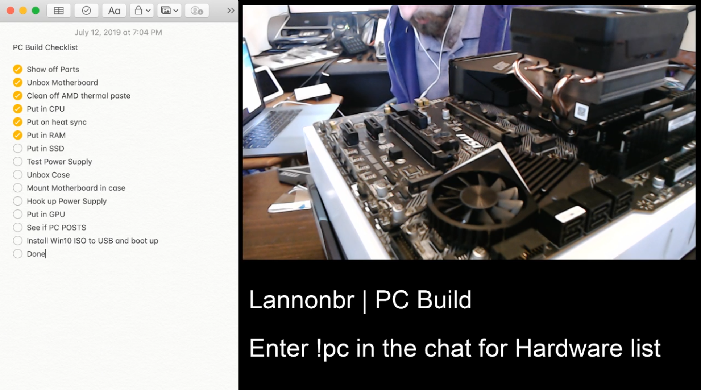

So, I built my PC live a little bit over a week ago. We went from the entire process of starting with a bunch of boxes and got all the way to Windows 10 fully installed on the machine.

## Specs

- Ryzen 7 3700x CPU
- Nvidia RTX 2070 Super Founders Edition GPU
- Corsair Vengence LPX 32GB (2 x 16GB) DDR4-3200 Memory
- Samsung 970 Evo Plus 1TB M.2 NVME SSD
- MSI MPG X570 Gaming Edge Wifi Motherboard
- Fractal Focus G ATX Mid Tower Case
- EVGA G3 750W 80+ Gold Power Supply

## Looking back and ahead

The build took about 4 hours to go through from start to finish, and it may of gone a little faster if it was just me, but I thought it would be cool if I streamed the process and discussed what I did. I had some comments from some of my viewers that the process was much easier than they expected and it was good to hear that it was a fairly straightforward process. Compared to other hardware projects, PC Building is like putting together LEGO parts till you have a finished machine.

Now that I have the machine up and running. I will be transferring my stream over to using this machine. I've been using Windows Subsystem for Linux (WSL) for the past week with VS Code's [Remote Dev Extension](https://code.visualstudio.com/docs/remote/wsl) which has allowed me to work in a Unix-based system as I am used to. On top of such, given most of my apps I use are electron-based, everything transitioned smoothly to Windows. Finally, having the convienence of incremental improvements in the PC rather than completely new machines will be useful.

If you wish to hear about some updates, tune in this Wednesday (Jul 24, 2019) at 4pm ET for my next livestream. Until then, stay tuned.
